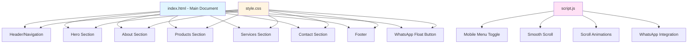

# Design Document: Stationery Xerox Website

## Overview

The Shree Swami Stationery and Xerox website is a modern, responsive business website designed to increase local visibility for a stationery and printing shop in Idar, Gujarat. The website serves as a digital storefront that showcases products and services, enables quick customer contact via phone and WhatsApp, and builds trust through a professional online presence. The target audience includes students, office workers, and local customers who need stationery supplies and printing services. The website will be built using vanilla HTML5, CSS3, and JavaScript without any frameworks, ensuring lightweight performance and easy deployment on platforms like GitHub Pages or Netlify.

## Architecture

The website follows a single-page application (SPA) architecture with multiple sections accessible through smooth scrolling navigation. The architecture is organized into three layers: presentation (HTML structure), styling (CSS), and behavior (JavaScript).

## Components

- Navbar
  - Logo (Shop Name)
  - Navigation Links (Home, Products, Services, Contact)
  - Mobile Hamburger Menu

- Hero Section
  - Title
  - Tagline
  - Call-to-action button

- Products Section
  - Product Card (image, name, price)

- Services Section
  - Service Card (icon, title, description)

- Contact Section
  - Phone number
  - Address
  - Google Map
  - WhatsApp button

- Footer
  - Links
  - Contact info

## Data Model

Product:
- name: string
- price: number (optional)
- image: string

Service:
- title: string
- description: string
- icon: string

Contact:
- phone: string
- address: string
- whatsappLink: string

## User Interactions

- Clicking navigation links scrolls to sections
- Clicking WhatsApp button opens chat with pre-filled message
- Clicking phone number initiates call
- Mobile menu toggles on click
- Scroll triggers animations for sections

## UI/UX Guidelines

- Color Scheme: Blue and White
- Typography: Clean sans-serif fonts
- Layout: Grid/Flexbox
- Mobile-first responsive design
- Smooth scrolling behavior
- Hover effects on buttons and cards

## State and Logic

- Mobile menu open/close state
- Scroll position tracking for animations
- Active navigation highlighting

## External Integrations

- WhatsApp API (wa.me link)
- Google Maps embed (iframe)

## Edge Cases

- Missing images fallback
- Invalid or missing phone number
- Mobile responsiveness issues
- Slow internet loading

## User Flow

1. User lands on homepage
2. Views hero section and shop introduction
3. Scrolls to products/services
4. Clicks on WhatsApp or phone
5. Contacts business

## File Structure

- index.html
- style.css
- script.js
- /images
  - products
  - shop

## Performance Considerations

- Optimize images (compressed format)
- Minimize CSS and JS
- Use lazy loading for images
- Ensure fast loading on mobile networks

## Accessibility

- Use semantic HTML tags
- Add alt text for images
- Ensure sufficient color contrast
- Keyboard navigation support

## SEO Considerations

- Use proper meta tags
- Add title and description
- Use keywords like "stationery shop in Idar"
- Optimize images with alt text